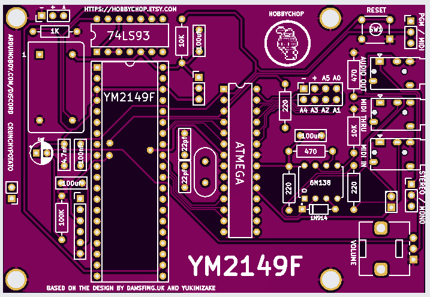

## Project Details

This project re-designs the hardware and software of the YM2149F for Arduino, inspired by Dansfing’s 2.1a version, which is driven by an ATMEGA328P chip and includes a CH430e TTL for USB programming. The original code was initially developed by Yukimizake, whose work inspired Dansfing. This version introduces several key changes:

- Relocates all user interface elements and inputs/outputs to the front of the board.
- Replaces the DIN5 connector with only 3.5mm TRS to conserve space.
- Adds more default sound presets.
- Switch between preset banks with CC-8 ( 1-64 selects Bank A, 64-127 is Bank B )
- Reduces some larger samples to free up code space.
- Introduces MIDI-responsive velocity and pitch bend, with plans to support envelope control.
- Ability to add noise coloring to presets easily.
- Simplifies the process for converting and adding new samples.
- Backwards compatibility with Dansfing 2.1a minus the display board.
- Functional orientation will be horizontal.
- 3D printed bottom shell (will be open source when it is done).
- Open source board gerber (coming soon).
- Parts list (coming soon).
- All chips should be socketed for easy replacement.

PCB Layout:

## Project History

I first discovered the YM2149F through one of my favorite musicians and YouTube creators, Lab Rat Warfare. My first hardware build was the Dansfing 'Arduino USB MIDI YM2149F,' and I instantly fell in love with its sound. Inspired by Dansfing’s robust hardware and software design, I decided to create my own layout based on the Dansfing 2.1a version of the code and schematics. This re-design is a tribute to Dansfing’s solid work, which sounds fantastic and sparked my passion for the YM2149F.

## Project Goals

This project aims to create a plug-and-play YM2149F interface with as many direct MIDI controls as possible, including velocity, pitch, and envelope adjustments. The code will be detailed to allow others to modify existing sounds or create their own from scratch. I want users to be able to create and import custom sound samples easily. I may also add an OLED display, similar to Dansfing’s setup. I would like to try and get a working vibrato and arpeggiator in the future.

## YM2149F Hardware Description

The YM2149F is an audio chip designed by Yamaha in the late 1970s, based on the AY-3-8910 sound chip from General Instrument. It was widely used in various 8-bit and 16-bit computers, consoles, and arcade machines, including the Atari ST, Amstrad CPC, and MSX series, due to its affordability and versatility for creating synthesized sounds.

- 3 Sound Channels: The YM2149F has three independent square wave generators, allowing it to produce three distinct tones simultaneously. Each channel can be independently controlled in terms of frequency and volume.

- Noise Generation: The chip includes a noise generator, which can be mixed with any of the three channels. This allows for the creation of percussion sounds and sound effects like explosions and engine noises.

- Programmable Volume Levels: Each channel has 16 levels of volume control, allowing dynamic adjustment of sound intensity.

- Envelope Generator: The YM2149F features an envelope generator that can apply varying shapes to control the amplitude of sounds over time. There are 16 envelope shapes that produce effects like fades, pulses, and sustained sounds, adding depth to the sound produced.

- Frequency Range: Each sound channel can be set to different frequencies, supporting a range of pitches that allow for the simulation of various musical notes.

- Compact Design: Its small form factor and relatively low power consumption made it a popular choice for compact and portable devices in the 1980s.

Registers: The YM2149F is controlled through a set of registers. Different registers control the tone frequency, volume, noise, and envelope for each channel.
Clock Frequency: The chip typically operates at a clock frequency around 2 MHz, which is then divided internally to produce sound frequencies.
Control Interface: It uses a simple data and address bus interface, making it relatively easy to integrate with microprocessors for real-time sound control.

## Installation

**ARDUINO-YM2149.ino, BANK-A.ino, BANK-B.ino** - for the hardware:

1. Clone this repository.
2. Connect the USB-C cable to your computer and use the Arduino IDE set to Arduino Uno to program the chip with the .ino file.

**ym2149-wave.py** - creating your own samples:

1. Prepare a short WAV sample using a program like Audacity.
2. Modify the 'path to .wav' in the script to point to the location of your .wav file.
3. Run the Python script and copy the output.

The script will generate 'PROGMEM const char' values and 'const int' length values for YM2149 code samples. You can paste these over existing values or create new ones. Keep in mind that samples must be short due to limited space.
The code size cannot exceed 31.5 KB, the maximum code space for the ATMEGA328P.

## Usage

The code includes detailed comments to help you create custom presets. Code related to sound presets can be found in the playNote and stopNote sections, both of which need to be configured for each sound preset.

## Features

- **MIDI TRS**: MIDI IN via 3.5mm TRS port. MIDI thru in the future.

- **14+ Presets (28 possible)**: Presets are on MIDI channels 1-14, with 2 banks of presets, for a total of 28 possible presets.

- **3 Voice Polyphonic**: Three voice channels can play simultaneously as long as they’re assigned to separate registers. For example, MIDI Channels 1-3 share the same preset but operate on different voice channels, allowing all three to play at once.

- **Velocity**: Velocity sensitivity is implemented for MIDI Channels 1-4. (Use the example to add it to other channels as needed.)

- **Arpeggiation** - Arpeggiation with rate, octave shift and 16 unique patterns.

- **Vibrato** - Vibrato rate and depth.

- **Pitch Bend**: Pitch bend is supported on all channels except Channel 10 (sample channel).

- **4 bit Samples**: Includes five short drum samples on MIDI Channel 10, with an option to add or replace them using the included Python script.

- **Programming and MIDI Mode**: Use the toggle switch to switch between MIDI mode and programming mode. Programming mode is for flashing new code.

## CC
Pitch Wheel - Pitch Bend

CC1 - Detune +-64

CC2 - Vibrato Rate (0 = off)

CC3 - Vibrato Amount

CC4 - Velocity Sensitivity, (0 = 0ff), 1 - 127 Adjust Range (1 has the least sensitivity) (0 = off)

CC5 - Arpeggiation Rate (0 = off)

CC6 - 8 x Arpeggiation Patterns

CC7 - Arp Mode (Use self or use default voice A)

CC8 - Arpeggiation Octave 
(0 = off | 1-21, -36 | 22-43, -24 | 44-63, -12 | 64-84, 0 | 85=105, +12 | 106-126, +24 | 127 = +36)

CC9 - Preset Bank Change, 1-64 Bank A or 65-127 Bank B

CC10 - Short notes (work in progress)

## Arpeggiation Patterns

Pattern 1: [C, G, C] // Root, Perfect Fifth, Octave

Pattern 2: [C, G, C] // Octave, Perfect Fifth, Root

Pattern 3: [C, C, G] // Root, Octave, Perfect Fifth

Pattern 4: [C, E♭, G] // Root, Minor Third, Perfect Fifth

Pattern 5: [C, G, E♭] // Root, Perfect Fifth, Minor Third

Pattern 6: [C, C, E♭] // Root, Octave, Minor Third

Pattern 7: [C, F, G] // Root, Perfect Fourth, Perfect Fifth

Pattern 8: [C, E, G] // Root, Major Third, Perfect Fifth

Pattern 9: [C, D, F] // Root, Major Second, Perfect Fourth

Pattern 10: [C, E♭, B♭] // Root, Minor Third, Minor Seventh

Pattern 11: [C, E, A♭] // Root, Major Third, Minor Sixth

Pattern 12: [C, E, B] // Root, Major Third, Major Sixth

Pattern 13: [C, G, A] // Root, Perfect Fifth, Minor Seventh

Pattern 14: [C, F, B] // Root, Perfect Fourth, Major Sixth

Pattern 15: [C, E, G♯] // Root, Major Third, Augmented Fifth

Pattern 16: [C, A, C] // Root, Major Sixth, Octave

## BANK A Presets (Each preset is on a different MIDI Channel)

Use CC9 to switch from Bank A to B

- CH. 1: Voices 1 **Voices(A)** **Default Voice**. Play concurrently with any preset with voices (B and C).
- CH. 2: Voices 1 **Voices(B)** **Default Voice**. Play concurrently with any preset with voices (A and C).
- CH. 3: Voices 1 **Voices(C)** **Default Voice**. Play concurrently with any preset with voices (A and B).
- CH. 4: Voices 3 **Voices(A, B and C)** **Gritty / Modulated**. Cannot play concurrently with other presets.
- CH. 5: Voices 3 **Voices(A, B and C)** **Gritty / Modulated**. Cannot play concurrently with other presets.
- CH. 6: Voices 1 **Voices(A)** **Gritty / Horn-Like / Modulated**. Play concurrently with any preset with voices (B and C).
- CH. 7: Voices 2 **Voices(A and C)** **Gritty / Very Bassy**. Play concurrently with any preset with voices (B).
- CH. 8: Voices 2 **Voices(A and B)**  **Gritty / Modulated / Great Bass**. Play concurrently with any preset with voices (C).
- CH. 9: Voices 2 **Voices(A and B)**  **Gritty / Great Bass**. Play concurrently with any preset with voices (C).
- CH. 10: Drum Samples *See Note to Sample Map. Play concurrently with any preset with voices (A, B and C).
- CH. 11: Voices 1 **Voices(A)** **Small Voice / Modem Tones**. Play concurrently with any preset with voices (B and C).
- CH. 12: Voices 3 **Voices(A, B and C)**  **Gritty / Great Bass / Modulation**. Cannot play concurrently with other presets.
- CH. 13: Voices 3 **Voices(A, B and C)**  **Heavy Modulation**. Cannot play concurrently with other presets.
- CH. 14: Voices 3 **Voices(A, B and C)** **Gritty / Modulated**. Cannot play concurrently with other presets.
- CH. 15: Empty
- CH. 16: Empty

## BANK B Presets (Each preset is on a different MIDI Channel)

There are 14 more presets on Bank B but I havent completely finished them...
Use CC9 to switch from Bank A to B

### *Note Sample Map (CH. 10)

Note/MIDI Value/Code Value: Description

C3/60/PROGMEM const char s4[]: Dog Yap

C#3/61/PROGMEM const char s3[]: Bass Thing

D3/62/PROGMEM const char s2[]: Hi-Hat

D#3/63/PROGMEM const char s1[]: Snare

E3-64/PROGMEM const char s0[]: Kick Drum

## Contacts and Resources

Discord: https://discord.gg/32wfnbkCtE

Dansfing's builds and code: https://dansfing.uk

Dansfing USB MIDI YM2149, simple to build. (You may be able to get a pre-built USB MIDI for sale from Dansfing): https://dansfing.uk/ym2149f.php

Yukimizake build and code: https://electronicfields.wordpress.com/2012/04/09/ym2149-sound-generator-arduino-fast-pin-switching

Lab Rat Warfare: https://www.youtube.com/@LabRatWarfare
